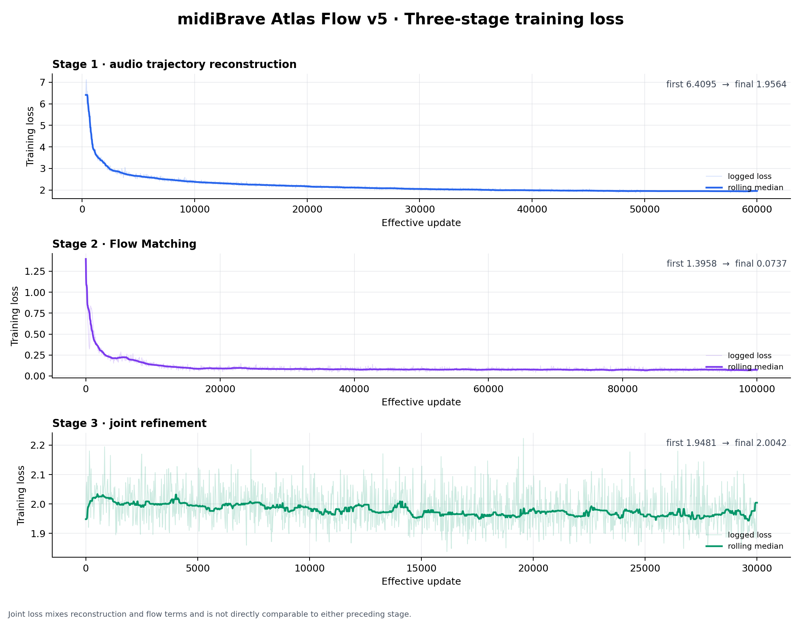

# midiBrave Atlas Flow v5 完整交接文档

| 文档字段 | 内容 |
|---|---|
| 文档日期 | 2026-08-26 |
| 代码分支 | `feat/atlas-flow-v5` |
| 模型状态 | Pad 单音研究 Demo；三阶段训练完成，正式质量门禁未通过 |
| 评估结论 | **NO-GO，当前不能宣称达到 ISMIR Late-Breaking/Demo 论文标准** |

## 1. 交接摘要

Atlas Flow v5 面向“可 MIDI 演奏、可沿音色轨迹生成、可在潜空间连续漫游”的目标，将音频轨迹编码、Flow Matching 轨迹预测、MIDI 条件解码和音色图谱控制组合为一个端到端原型。

本次交接已经完成以下工程闭环：

- Pad Top50 数据的三阶段训练已完成：Stage 1 为 60,000 步，Flow 为 100,000 步，Joint 为 30,000 步。
- 当前 checkpoint 为 `step-000030000.pt`，SHA-256 为 `c4207b347099033184616be8be0862338b55157747439c8896525438b0bbe7ba`。
- 静态对照试听、质量门禁和实时潜空间乐器已整合进 Dashboard。
- Spark GPU Runtime 已完成资格测试和 WebSocket 实际演奏链路测试，并由自动守护任务维持运行。
- Octopus 上的推理、评估定时器和 Portal 已停止，不再占用 Octopus GPU；历史训练产物、checkpoint 和 TensorBoard 记录保留。
- 当前实现已推送至 GitHub 新分支：<https://github.com/Twiddle-AI-China/Latent-Cosmos-Synth/tree/feat/atlas-flow-v5>。

需要特别强调：工程链路可运行不等于模型质量达标。当前正式评估只通过 9 个质量门禁中的 4 个；MIDI 跟随、尾部稳定性、边界连续性和响度误差仍未达标。

## 2. 当前能力边界

| 能力 | 当前状态 | 说明 |
|---|---|---|
| 5 秒音色轨迹重建 | 已实现 | 编码真实音频得到 128D 随时间变化的潜轨迹，再由 MIDI 条件解码器重建 |
| 无 Source 轨迹预测 | 已实现 | Flow 根据历史、音色锚点、生命周期和 Atlas 控制预测后续轨迹 |
| MIDI 音高注入 | 已实现但质量未达标 | MIDI 只进入解码分支；正式评估的 MIDI 跟随率为 79.63% |
| 持续发声 | 已实现为运行时策略 | 对训练所得 5 秒轨迹的 sustain 区间做时间扭曲循环，不是模型无限外推 |
| 鼠标音色漫游 | 已实现 | 在 PCA 前两维移动，投影到合法局部 Atlas 凸包后平滑过渡 |
| PCA 8D 控制 | 已实现 | 八个滑杆均先经过合法区域投影，再用于轨迹生成 |
| 跨连通分量切换 | 已实现为音频交叉淡化 | 不对无连边区域做潜向量直线插值 |
| 多音演奏 | 未实现 | 当前 Runtime 为单音原型 |
| Lead/Bass/Pluck | 未训练 | 当前只有 Pad Top50 模型 |
| 速度力度建模 | 未完整实现 | 训练数据 velocity 固定为 127；运行时 velocity 主要控制输出增益 |

## 3. 系统架构

### 3.1 总体数据流

```text
5 s 音频
  -> 音高归一化声学特征 [96D, hop=512]
  -> 因果轨迹编码器
  -> 音色轨迹 z(t) [128D, hop=2048]
       |
       +-> 真实动态轨迹重建（Dynamic）
       +-> 时间均值轨迹消融（Static）
       +-> Atlas PCA/图结构与 Flow Matching 训练

历史轨迹 + 128D 锚点路径 + 8D Atlas 路径 + 4D 生命周期
  -> 条件 Flow Transformer
  -> 预测未来 64 帧的 128D 轨迹残差
  -> Heun ODE 求解
  -> 预测音色轨迹

128D 轨迹
  -> 128->256 Adapter
  + MIDI note 32D 条件
  + 相位连续谐波激励
  -> BRAVE/RAVE 风格解码器
  -> 44.1 kHz 音频
```

### 3.2 音频轨迹分支

输入首先转换为 96D 音高归一化声学特征，特征 hop 为 512 samples。因果编码器将其压缩为 128D 轨迹，轨迹 hop 为 2048 samples。设计目标是让 128D 表征主要承载音色随时间的变化，并通过同 preset 跨音高重建和音高对抗约束减少绝对音高泄漏。

解码时，128D 轨迹经 Adapter 映射到 256D 解码音色条件；MIDI note 单独编码为 32D 条件，并与相位连续谐波激励共同进入解码器。因此当前版本的结构是“轨迹负责音色与时间演化，MIDI 分支负责音高”，不是把 MIDI 直接输入 Flow。

### 3.3 Flow Matching 分支

Flow 模型的具体结构如下：

| 项目 | 配置 |
|---|---:|
| 历史上下文 | 32 帧 × 128D |
| 预测未来 | 64 帧 × 128D |
| Transformer 宽度 | 256 |
| Context layers | 2 |
| Future layers | 8 |
| Attention heads | 8 |
| FFN 维度 | 1024 |
| Dropout | 0.05 |
| 生命周期条件 | 4D |
| Atlas 条件 | 8D |
| 音色锚点条件 | 128D |
| 训练/离线评估求解步数 | 8 |
| 实时求解步数 | 4 |

模型先将目标轨迹表示为相对 Atlas 锚点路径的残差，再学习从噪声到真实残差的条件速度场。未来 token 同时接收 Flow time、历史声学状态、历史锚点、未来锚点路径、8D Atlas 路径和 4D attack/sustain/release 生命周期。推理时采用 Heun 方法积分速度场并逐段滚动生成。

Flow 本身不接收 MIDI note。这样可以避免把音高变化错误编码为音色轨迹，但也意味着 MIDI 跟随质量主要依赖解码器的音高条件与激励设计。

### 3.4 音色 Atlas

Atlas 使用训练集 128D 轨迹的时间统计构建音色锚点，并在训练集上拟合 8D PCA。当前 Pad Top50 图谱包含 50 个锚点、48 条 mutual 4-NN 边和 14 个连通分量，分量大小为 `21, 5, 1, 1, 11, 2, 1, 2, 1, 1, 1, 1, 1, 1`。

用户控制不会直接把任意 8D 数值送入模型：

1. 鼠标控制 PCA 前两维，滑杆控制完整八维。
2. 控制点被投影到邻近锚点构成的合法局部凸包。
3. 同一连通分量内沿 Atlas 路径进行平滑轨迹过渡。
4. 跨不连通分量时使用音频域交叉淡化，不假设中间潜空间有效。

这种设计可以降低用户移动到未训练潜空间后产生静音、爆音或无意义轨迹的概率，但当前图谱碎片较多，说明 Pad Top50 的潜空间连续性仍需改进。

### 3.5 参数量

| 模块 | 参数量 |
|---|---:|
| 因果轨迹编码器 | 630,528 |
| 128→256 Adapter | 98,816 |
| BRAVE 解码器 | 7,916,400 |
| MIDI pitch conditioner | 6,208 |
| 输出增益 | 129 |
| 音高对抗器 | 33,024 |
| Flow Transformer | 13,544,576 |
| **总计** | **22,229,681** |

训练配置中所有模块均保持 `requires_grad=true`。阶段训练只通过 optimizer 参数路由决定当阶段更新哪些模块，不属于永久冻结；Joint 阶段已经验证各模块梯度范数均大于零。

## 4. 数据说明

### 4.1 当前训练集

| 项目 | 当前值 |
|---|---|
| 类别 | Pad |
| preset 数量 | Top50 |
| 样本数 | 2,700 |
| preset 切分 | 45 train / 2 validation / 3 test |
| 音高范围 | MIDI 36–71 |
| 每条时长 | 5.0 s |
| 采样率 | 44.1 kHz |
| Note-on | 0.1 s |
| Note-off | 2.6 s |
| Velocity | 127 |

切分按 preset 隔离，而不是随机按音频行切分，避免同一音色同时出现在训练集与测试集。原始合成音频、特征 cache、轨迹 cache、Atlas 和训练输出均作为不同层级的可复用产物保存。

### 4.2 目标四类数据

项目后续正式范围为 Lead、Pad、Bass、Pluck 四类，每类选择 Top50 preset，分别训练与评估。当前 checkpoint 只覆盖 Pad，不能把结果外推为四类模型已经完成。建议先修复 Pad 的质量门禁，再以完全相同的数据契约、评估协议和日志 schema 扩展另外三类。

## 5. 训练方案与结果

### 5.1 Stage 1：轨迹编码与音频重建

目标是从头学习与新数据标注一致的轨迹编码器、Adapter、MIDI 条件解码器和音频重建能力，没有复用旧版 Lead Decoder checkpoint。

损失为：

```text
L_stage1 = 1.0 * mean(self MR-STFT, cross-note MR-STFT)
         + 0.5 * multi-band / short-FFT loss
         + 0.1 * envelope loss
         + 0.25 * RMS loss
         + 0.1 * same-preset trajectory loss
         + 0.05 * pitch-adversarial loss
```

其中 cross-note reconstruction 使用音色轨迹 A 配合 MIDI note B 重建同 preset 的 B 音高样本，促使音色轨迹与音高控制解耦。当前损失未包含 CLAP loss；若后续加入，应作为消融实验验证其是否改善音色相似性，而不是直接替代时域包络、边界和轨迹动态约束。

训练 60,000 个有效更新，global batch 为 256。首个记录点 update 320 的 loss 为 6.4095，最终 loss 为 1.9564。累计发生 17 次非有限更新跳过，但最终连续非有限计数为 0，训练正常收敛并完成。

### 5.2 Stage 2：Flow Matching

损失为：

```text
L_flow = 1.0 * velocity MSE
       + 0.10 * history/future boundary Smooth-L1
       + 0.02 * mean/std statistics loss
       + 0.05 * first/second-order temporal-motion loss
```

训练 100,000 个有效更新，global batch 为 768。loss 从 1.3958 降至 0.0737，未发生非有限更新。

### 5.3 Stage 3：联合微调

Joint 阶段同时计算音频重建目标和 Flow 目标，并加入 0.10 权重的编码轨迹与 Flow 重建轨迹对齐项。音频 global batch 为 160，Flow global batch 为 80，学习率降至 `2e-5`，共训练 30,000 个有效更新。

Joint 总 loss 从 1.9481 到 2.0042。该数值混合了不同 batch、不同尺度的音频与 Flow 项，不能与 Stage 1 或 Stage 2 直接横向比较，也不应仅凭总 loss 末值略高判定训练退化。更可靠的判断依据是分项曲线、梯度健康、固定验证集和最终听感/质量门禁。Joint 阶段无非有限更新，所有模块均有非零梯度。

### 5.4 Loss 曲线



图中浅色为原始记录，深色为滚动中位数。完整机器可读摘要见 `docs/evidence/atlas-flow-v5-evidence.json`。

## 6. 评估与试听 Dashboard

### 6.1 四种试听模式

| 模式 | 含义 | 用途 |
|---|---|---|
| Source | 测试集真实参考音频 | 目标上界与听感基准 |
| Dynamic | 编码真实 Source 得到完整动态轨迹，再用当前解码器重建 | 衡量轨迹编码与动态重建能力 |
| Static | 将真实轨迹取时间均值并在全时长复制，再解码 | 消融轨迹随时间变化的价值 |
| Flow | 只给初始历史、Atlas/锚点和生命周期，由 Flow 预测后续轨迹后解码 | 衡量没有完整 Source 轨迹时的预测能力 |

当前试听集从 3 个严格隔离的 test preset 中选取 6 个代表音高，即 MIDI 36、43、50、57、64、71，共 18 个试听单元。每个单元包含四种模式，因此有 72 个规范 WAV；另保留 12 个旧版兼容别名，总计 84 个 WAV。

### 6.2 正式质量门禁

评估管线完整运行，共生成 108 条 metric rows。结果为 **4/9 通过**：

| 指标 | 当前值 | 门槛 | 结果 |
|---|---:|---:|---|
| MIDI 跟随率 | 79.63% | ≥95% | 失败 |
| Dynamic 相对 Static 中位收益 | 11.44% | ≥5% | 通过 |
| Dynamic 受益样本比例 | 74.07% | ≥70% | 通过 |
| Flow 静音失败率 | 0% | ≤1% | 通过 |
| 最大尾部 RMS 漂移 | 22.88 dB | ≤12 dB | 失败 |
| 最大边界比 | 16.43 | ≤4 | 失败 |
| Flow RMS 误差中位数 | 9.20 dB | ≤6 dB | 失败 |
| Flow RMS 误差 P90 | 14.14 dB | ≤12 dB | 失败 |
| 确定性复现 | 100% | 必须通过 | 通过 |

结果说明动态轨迹对多数样本确有价值，且 Flow 不会普遍静音；但音高准确性、响度、note-off 边界和尾部稳定性不足。当前模型适合内部演示和研究迭代，不适合直接作为已验证的 LBD 结果对外发布。

### 6.3 实时乐器

实时页面支持：

- 键盘/界面触发单音 MIDI note；
- 按住期间持续发声，松开后进入 release；
- 鼠标在 PCA 平面移动时，以默认 2 秒、可调 0.5–5 秒的 morph 时间连续改变音色；
- 八个 PCA 滑杆实时改变完整控制向量；
- Runtime 返回 attack/sustain/release 状态、控制投影与音频块遥测。

训练样本只有固定 5 秒，完整轨迹约 108 帧。实时持续发声并不是让模型无限向未来预测；Runtime 先生成规范 5 秒轨迹，在约 1.2–2.4 秒的 sustain 区间执行相位连续的时间扭曲循环，note-off 后切到约 2.6 秒开始的 release 区间。音色控制变化会异步规划新轨迹并平滑过渡，因此鼠标移动时声音不会被停止。

## 7. Spark 运行与运维

### 7.1 当前拓扑

```text
浏览器
  -> Spark Portal :18790（CPU 常驻服务）
       +-> 静态 Dashboard
       +-> 评估 JSON/WAV
       +-> /api/runtime-status
       +-> /runtime WebSocket 反向代理
             -> Spark GPU Runtime :8791（SLURM + Docker，1 GPU）
```

CPU Portal 不提交 SLURM；GPU Runtime 必须通过 SLURM 启动，并在 Docker 中只挂载调度器分配的 GPU。当前部署不使用 `--gpus all`。

核心服务模板：

- `midibrave-atlas-flow-spark-portal@.service`：CPU Portal；
- `midibrave-atlas-flow-spark-live@.timer`：GPU Runtime 自动守护；
- `midibrave-atlas-flow-spark-live@.service`：执行一次守护检查和必要的重提交流程。

当前热数据根为 `/data/atlas-flow-pad-v1`，主要子目录包括：

- `runs/pad-v1`：checkpoint 与训练输出；
- `evaluation/pad-v1`：评估报告与试听 WAV；
- `atlas`：PCA/图结构；
- `manifests`：数据清单；
- `evidence/training-metrics`：三阶段训练日志副本；
- `contracts/spark-gb10/v5`：Runtime 资格测试完成标记；
- `logs`：Spark 作业日志。

### 7.2 运行验收

Spark 资格测试结果：

- 设备：NVIDIA GB10，单卡可见；
- checkpoint：`step-000030000.pt`；
- 音频块：4096 samples，对应 deadline 92.88 ms；
- warm 后规划中位时间：72.03 ms；
- MIDI 36、57、71 均无持音静音块，输出有限值，release 最终回到 0；
- WebSocket 真实链路验证通过：note-on、持续 PCM、PCA 控制改变、持续发声、note-off、回到 idle 全部成功；
- 容器内自动化测试：25 passed。

### 7.3 常用只读检查

```bash
# GPU Runtime 作业
squeue -o '%i %j %T %M %l %b %R'

# Portal 与自动守护
systemctl status midibrave-atlas-flow-spark-portal@${SERVICE_USER}.service
systemctl status midibrave-atlas-flow-spark-live@${SERVICE_USER}.timer

# Portal、Runtime 健康状态
curl -fsS http://127.0.0.1:18790/api/health
curl -fsS http://127.0.0.1:18790/api/runtime-status
```

### 7.4 停止与恢复

优雅停止顺序：先禁用自动守护，避免作业被自动重提；再取消对应 SLURM 作业；最后按需停止 Portal。

```bash
sudo systemctl disable --now midibrave-atlas-flow-spark-live@${SERVICE_USER}.timer
scancel <atlas-flow-live-job-id>
sudo systemctl stop midibrave-atlas-flow-spark-portal@${SERVICE_USER}.service
```

恢复顺序：启动 Portal，启用自动守护，由守护脚本检查资格标记、checkpoint 和现有作业后提交 Runtime。

```bash
sudo systemctl enable --now midibrave-atlas-flow-spark-portal@${SERVICE_USER}.service
sudo systemctl enable --now midibrave-atlas-flow-spark-live@${SERVICE_USER}.timer
```

### 7.5 已处理的运行问题

- 首次资格测试 OOM 的原因是节点上残留了与本项目无关的 GPU 推理容器；清理该临时容器后相同模型资格测试通过，因此该次 OOM 不构成模型或 checkpoint 失效证据。
- Spark 未配置 accounting backend 时，`priority/multifactor` 会导致新作业显示 `InvalidAccount`。控制器已调整为 `priority/basic` 并重载配置，既有作业未丢失。
- Runtime 脚本和 watchdog 将资格测试、完成标记、运行作业检测和有限次数重试串联，避免单次环境故障造成长期无人值守停机。

## 8. Octopus 当前状态

Octopus 已停止 Atlas Flow GPU Runtime，相关推理与评估 timer 均已禁用，Portal 已停止；当前无 Atlas Flow SLURM 作业和 GPU 进程。训练 checkpoint、评估产物、数据与 TensorBoard 日志保留，其中 TensorBoard 为 CPU-only 服务。

除非要重新训练或执行正式离线 GPU 评估，不应在 Octopus 恢复常驻推理。实时推理统一放在 Spark。

## 9. 代码与产物索引

| 内容 | 位置 |
|---|---|
| 模型、Flow、Atlas、Runtime | `src/midibrave/atlas_flow_*.py` |
| Spark/Octopus 配置 | `configs/atlas_flow/` |
| 实时 Dashboard | `atlas-flow-live-dashboard/` |
| Spark 部署脚本与服务模板 | `scripts/atlas_flow/spark_*`、`scripts/atlas_flow/midibrave-atlas-flow-spark-*` |
| 训练/评估命令入口 | `src/midibrave/atlas_flow_train.py`、`src/midibrave/atlas_flow_evaluate.py` |
| Runtime 服务入口 | `src/midibrave/atlas_flow_runtime_server.py` |
| Portal 入口 | `src/midibrave/atlas_flow_portal.py` |
| 自动化测试 | `tests/test_atlas_flow_*.py`、`tests/test_exported_runtime_audition.py` |
| Loss 绘图脚本 | `scripts/atlas_flow/plot_training_losses.py` |
| 机器可读证据 | `docs/evidence/atlas-flow-v5-evidence.json` |

运行镜像对应源码提交为 `003878a402e3ec7f15722ab9a34c50c1db31118b`。后续文档提交不会改变该镜像内的运行代码；若修改模型或 Dashboard 代码，必须生成新镜像标签并重新执行资格测试。

## 10. ISMIR LBD 差距与后续实验

当前结果不能直接投稿为已完成系统。要形成可信的 LBD 工作，建议把论文问题收敛为：**“显式音色轨迹建模与 Atlas 条件 Flow，是否比静态潜变量和既有 MIDI-only/Trajectory 基线更能保持音色动态并支持连续可控演奏？”**

优先级从高到低如下：

1. **修复当前四个失败维度。** 对 MIDI 错音案例逐条分析 pitch conditioner、谐波激励和解码器泄漏；对 note-off 边界、尾部漂移和响度误差增加对应训练采样与损失，并使用固定 test preset 回归。
2. **建立三版本统一基线。** 在同一数据、切分、步数和评估协议下比较早期 MIDI-only midiBrave、TrajectoryBrave 和 Atlas Flow；报告 Static、Dynamic、Flow 及关键模块消融。
3. **扩展统计可靠性。** 当前只有 3 个 test preset。正式实验至少增加 test preset 数、随机种子和置信区间，并覆盖音域边缘、不同生命周期位置及多档 velocity。
4. **补充感知评估。** 设计盲听 MUSHRA/ABX，分别评价音色一致性、动态自然度、音高正确性和 morph 连续性；报告参与人数、耳机筛查、显著性与效应量。
5. **评估 CLAP 约束。** 将 CLAP 或专用 timbre embedding loss 作为可选项，与无 CLAP 版本做消融。CLAP 只约束整体语义/音色相似性，不能替代 ADSR、onset/offset、边界和帧级动态监督。
6. **改善 Atlas 连续性。** 量化 14 个连通分量造成的不可达区域，比较局部图路径、可学习 chart、VAE/normalizing-flow 先验或带邻域正则的表征；跨分量交叉淡化应作为工程 fallback，而非论文核心生成能力。
7. **扩展四类模型。** Pad 质量门禁通过后，再依次训练 Lead、Bass、Pluck Top50，并分别报告类内结果，避免把四类混成一个平均指标掩盖失败类别。
8. **补齐实时性报告。** 除单次资格测试外，记录至少 30 分钟连续演奏的规划延迟 P50/P95/P99、音频 underrun、控制响应延迟、显存峰值和恢复次数。

建议 LBD 最低提交线：9/9 自动质量门禁通过；至少两种强基线和核心消融；跨 preset 的统计与盲听结果；可稳定运行的短视频/现场 Demo；明确区分模型能力与 runtime time-warp、交叉淡化等工程补偿。

## 11. 交接验收清单

- [x] 新分支包含 Atlas Flow v5 模型、训练、评估、Runtime、Dashboard 与 Spark 运维代码。
- [x] Pad Top50 三阶段训练完成，checkpoint 与日志可追溯。
- [x] Loss 图与机器可读证据已入库。
- [x] 静态评估与四模式试听包可由 Portal 提供。
- [x] Spark GPU 资格测试、WebSocket 演奏测试和 25 项自动化测试通过。
- [x] Spark 自动守护已启用。
- [x] Octopus 推理与评估任务已停止，GPU 已释放。
- [ ] 自动质量门禁仅通过 4/9，尚未达到发布线。
- [ ] Lead、Bass、Pluck 尚未按同一协议训练与评估。
- [ ] 三版本统一基线、感知实验和统计显著性尚未完成。

## 12. 结论

Atlas Flow v5 已形成一个可运行、可试听、可自动恢复的 Pad 单音潜空间乐器原型。模型证明了动态轨迹相对静态轨迹在多数样本上有收益，Flow 也能在没有完整 Source 轨迹时生成非静音结果；但它尚未解决音高可靠性、尾部/边界稳定和响度一致性。后续工作应先围绕失败门禁和统一基线完成研究验证，再扩展至 Lead、Bass、Pluck，并将感知实验与实时稳定性证据补齐后再判断 ISMIR LBD 投稿可行性。
